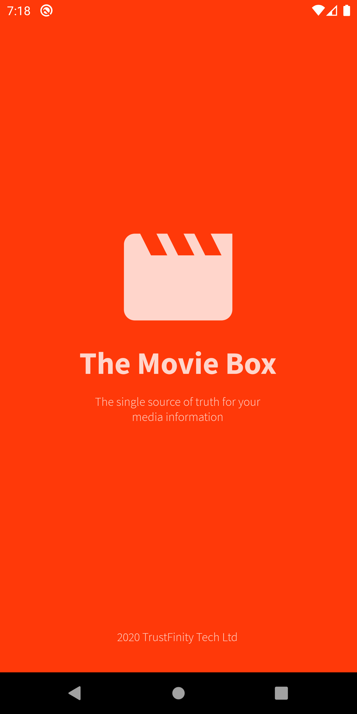
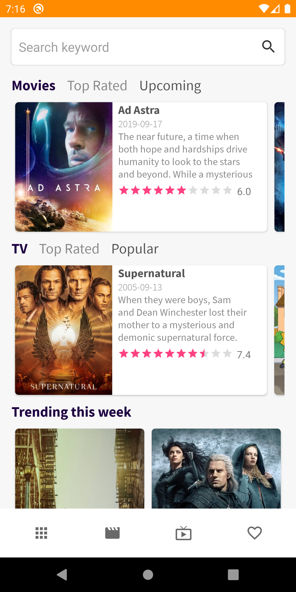
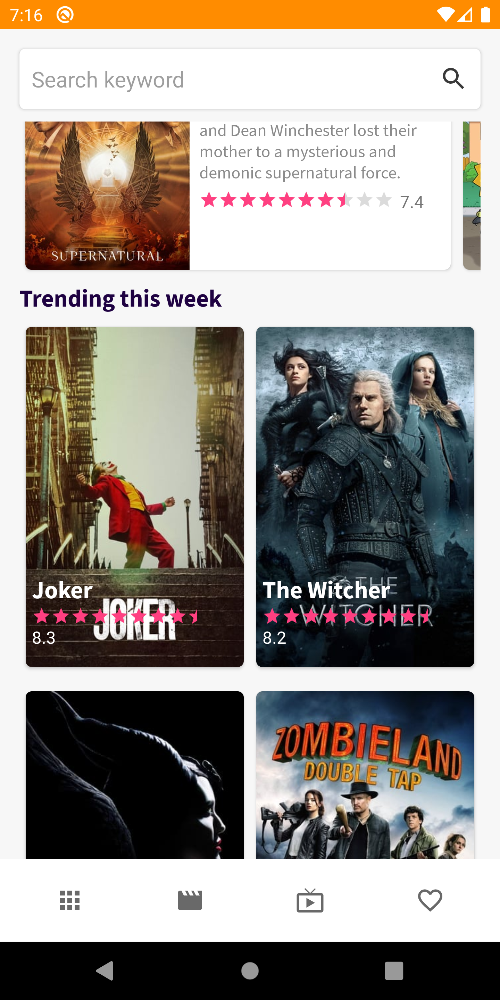
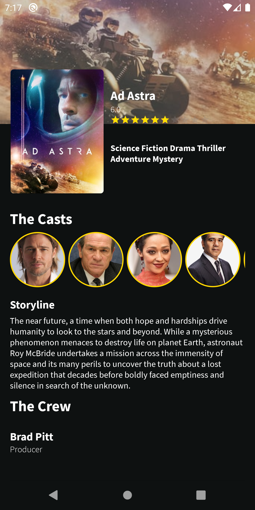

### The Movie Box
Android app built as a client for the movie db site.

- Minimum android version - lollipop 5.0
- Android Studio 3.5.3
- Build #AI-191.8026.42.35.6010548, built on November 15, 2019
- JRE: 1.8.0_202-release-1483-b49-5587405 x86_64
- JVM: OpenJDK 64-Bit Server VM by JetBrains s.r.o
- macOS 10.15.2

Clone repo and sync gradle, everything should be fine. Here are some screenshots 
to get you excited.









### License

#### MIT

```
Copyright (c) 2020 mwakaambrose

Permission is hereby granted, free of charge, to any person obtaining a copy
of this software and associated documentation files (the "Software"), to deal
in the Software without restriction, including without limitation the rights
to use, copy, modify, merge, publish, distribute, sublicense, and/or sell
copies of the Software, and to permit persons to whom the Software is
furnished to do so, subject to the following conditions:

The above copyright notice and this permission notice shall be included in all
copies or substantial portions of the Software.

THE SOFTWARE IS PROVIDED "AS IS", WITHOUT WARRANTY OF ANY KIND, EXPRESS OR
IMPLIED, INCLUDING BUT NOT LIMITED TO THE WARRANTIES OF MERCHANTABILITY,
FITNESS FOR A PARTICULAR PURPOSE AND NONINFRINGEMENT. IN NO EVENT SHALL THE
AUTHORS OR COPYRIGHT HOLDERS BE LIABLE FOR ANY CLAIM, DAMAGES OR OTHER
LIABILITY, WHETHER IN AN ACTION OF CONTRACT, TORT OR OTHERWISE, ARISING FROM,
OUT OF OR IN CONNECTION WITH THE SOFTWARE OR THE USE OR OTHER DEALINGS IN THE
SOFTWARE.```

